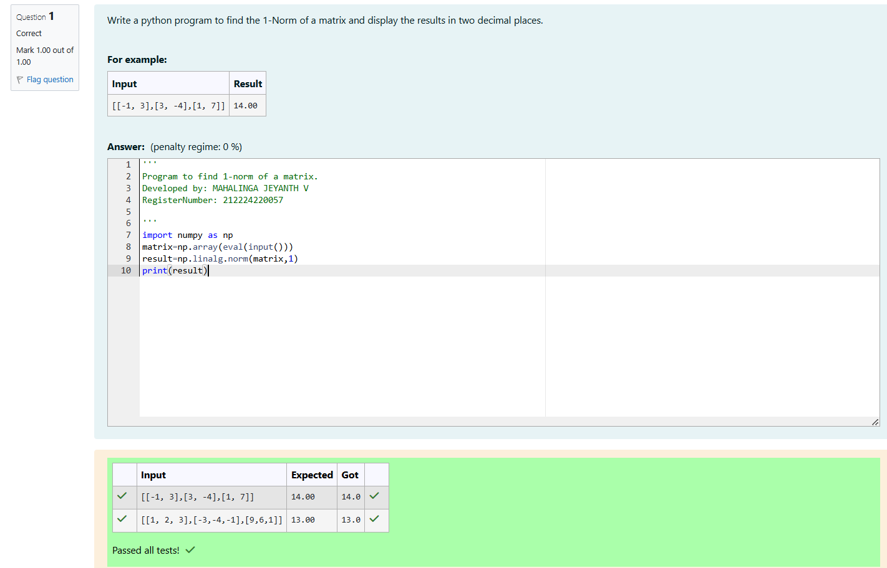
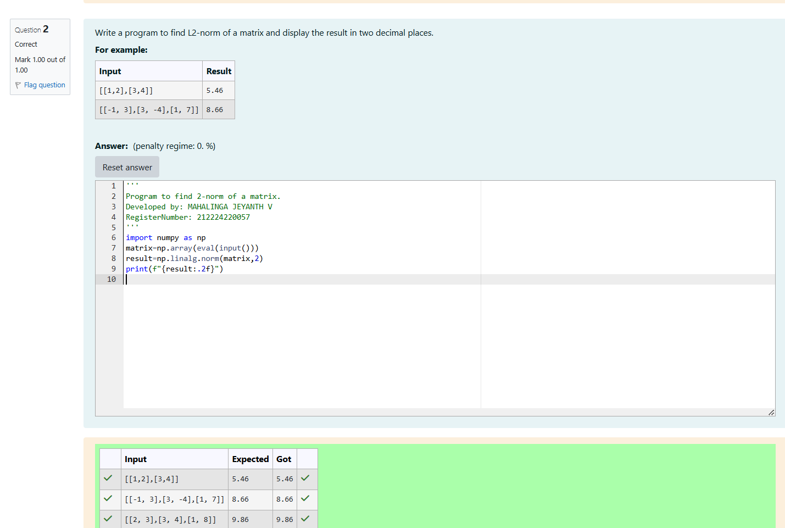
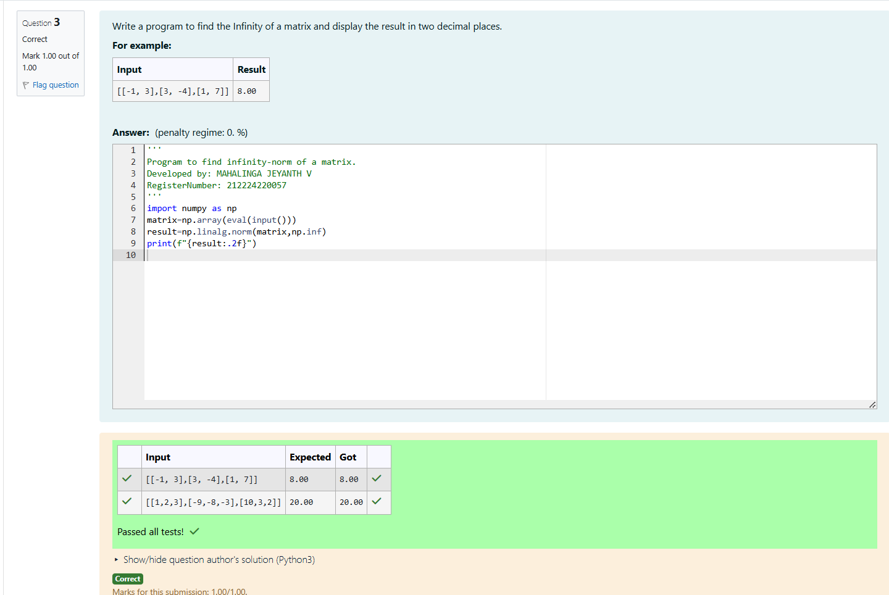

# Norm of a matrix
## Aim
To write a program to find the 1-norm, 2-norm and infinity norm of the matrix and display the result in two decimal places.
## Equipment’s required:
1.	Hardware – PCs
2.	Anaconda – Python 3.7 Installation / Moodle-Code Runner
## Algorithm:
## program-1

Get the input matrix using np.array()

Find the 1-norm of the matrix using np.linalg.norm()

Print the norm of the matrix in two decimal places.

## program-2

1.Get the input matrix using np.array()

2.Find the 2-norm of the matrix using np.linalg.norm()

3.Print the norm of the matrix in two decimal places.

## program-3

1.Get the input matrix using np.array()

2.Find the infinity-norm of the matrix using np.linalg.norm()

3.Print the norm of the matrix in two decimal places.


## Program:

# 1-Norm of a matrix

'''
Program to find 1-norm of a matrix.
Developed by: MAHALINGA JEYANTH V
RegisterNumber: 212224220057
```
import numpy as np
matrix=np.array(eval(input()))
result=np.linalg.norm(matrix,1)
print(result)

```


# 2-Norm of a Matrix

'''
Program to find 2-norm of a matrix.
Developed by: MAHALINGA JEYANTH V
RegisterNumber: 212224220057
```
import numpy as np
matrix=np.array(eval(input()))
result=np.linalg.norm(matrix,2)
print(f"{result:.2f}")

```


# InfinityNorm of a Matrix

'''
Program to find infinity-norm of a matrix.
Developed by: MAHALINGA JEYANTH V
RegisterNumber: 212224220057
```
import numpy as np
matrix=np.array(eval(input()))
result=np.linalg.norm(matrix,np.inf)
print(f"{result:.2f}")

```


## Output:
### 1-Norm of a Matrix




### 2-Norm of a Matrix




### Infinity Norm of a Matrix



## Result
Thus the program for 1-norm, 2-norm and Infinity norm of a matrix are written and verified.
